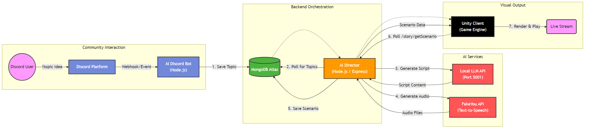

# AI_TF2: Automated AI Show Generator

An automated, interactive "TV show" generator featuring Team Fortress 2 characters. This system allows users to suggest topics via Discord, which are then turned into scripts by an LLM, voiced by AI (FakeYou), and acted out in a Unity 3D environment.



## Download & Play

**[Download the latest release here](https://github.com/TheSimonella/AI_TF2/releases)**

1.  Download `AI_TF2_Client.zip` from the Releases page.
2.  Extract the zip file.
3.  Run `2fort.exe` to start the client.

## Architecture

The system consists of three main components:

1.  **AI Director (`ai_director-fake-you`)**: The core orchestration service. It manages the story generation pipeline, interfacing with the LLM for scripts and FakeYou for TTS.
2.  **Discord Bot (`ai_discord_bot-main`)**: The community interface. It handles user suggestions, voting queues, and communicates with the Director.
3.  **Unity Client**: The visual renderer. It polls the Director for new scenarios and plays them out in real-time.

## Prerequisites

-   **Node.js** (v16 or higher)
-   **MongoDB** (Atlas or Local)
-   **Unity** (2021.3 or higher recommended)
-   **Local LLM** (e.g., Oobabooga Text Generation WebUI running on port 5001)
-   **FakeYou Account** (for TTS API access)

## Setup

### 1. AI Director

1.  Navigate to `ai_director-fake-you/ai_director-fake-you`.
2.  Install dependencies:
    ```bash
    npm install
    ```
3.  Create a `.env` file based on `.env.example` and fill in your credentials:
    ```env
    OPENAI_API_KEY=your_openai_key_here
    MONGODB_URI=your_mongodb_connection_string
    MONGODB_PASSWORD=your_mongodb_password
    ```
4.  Start the service:
    ```bash
    npm start
    ```

### 2. Discord Bot

1.  Navigate to `ai_discord_bot-main/ai_discord_bot-main`.
2.  Install dependencies:
    ```bash
    npm install
    ```
3.  Create a `.env` file based on `.env.example`:
    ```env
    DISCORD_TOKEN=your_discord_bot_token
    MONGODB_URI=your_mongodb_connection_string
    ```
4.  Start the bot:
    ```bash
    npm start
    ```

### 3. Unity Client

1.  Open the `bobsponge_client-advanced` folder in Unity Hub.
2.  Build and Run the project.

## Usage

1.  Join the configured Discord channel.
2.  Type `!topic <your idea>` to suggest a scene.
3.  Vote on suggestions.
4.  Watch the Unity window (or stream) to see the winning topic performed!

## License

[ISC](LICENSE)
